# INTERMEDIA residential explorer

  

  <strong>Step inside an illustrative P+3 residential complex.</strong> 
  Explore the blocks, pull the building apart, cut through its layers and peek inside representative homes.

  <a href="https://cristianexer.github.io/residential/">Open the live explorer</a> ·
  <a href="CONTRIBUTING.md">Contribute</a> ·
  <a href="LICENSE">MIT License</a>

## Welcome in

This is a bright, reference-based 3D presentation of the INTERMEDIA
residential complex. The scene is authored as a semantic Blender hierarchy,
exported to a compressed GLB, and explored in the browser with a lightweight
Three.js viewer.

It is designed to feel closer to browsing a place than opening a CAD file:
choose a block, orbit around it, inspect a component, or switch from the
complete exterior to an exploded or cutaway view.

## What you can explore

- **Four ways in:** Exterior, Exploded, Cutaway and Floors views.
- **Three representative homes:** studio, two-room and three-room furnished
  interiors.
- **A living site context:** landscaped parking, paths, trees, cars and
  dimensional INTERMEDIA signs.
- **A proper component inspector:** click visible architecture for framing,
  isolation and semantic metadata.
- **Walkthrough mode:** use WASD or the arrow keys after entering the model.
- **English and Romanian UI:** use the flag picker in the top bar.

The model is illustrative rather than survey-grade. The studio and balcony
figures come from the supplied brief; other apartment areas, room partitions
and site context are explicitly inferred.

## Try it locally

The GLB must be served over HTTP, so start a tiny static server from the
repository root:

~~~sh
python3 -m http.server 4173 --directory dist
~~~

Then open <http://127.0.0.1:4173/>. The public build is deployed by
[GitHub Pages](https://pages.github.com/) from dist/ whenever main is
updated. The repository workflow expects Pages to use **GitHub Actions** as
its source.

## Rebuild the scene

Scene generation requires Blender 5.1+, Python 3.10+, uv, and the Blender Lab
MCP bridge. See [blender/README.md](blender/README.md) for one-time setup and
connection checks.

From the repository root:

~~~sh
python3 scripts/run_blender_mcp.py blender/scene/build_scene.py
python3 scripts/validate_assets.py
~~~

The export process preserves the editable Blender source, validates the
candidate GLB before replacing the release asset, and updates the semantic
manifest only after a successful export. Asset provenance lives in
[dist/assets/licenses.json](dist/assets/licenses.json).

## Verify a change

Fast checks:

~~~sh
python3 scripts/validate_assets.py
node --check dist/viewer.js
~~~

Geometry regression checks use a fresh Blender process:

~~~sh
/Applications/Blender.app/Contents/MacOS/Blender --background --factory-startup --python blender/scene/check_build_scene.py
~~~

For browser interaction checks, start the local server and run:

~~~sh
npx --yes @playwright/cli -s=residential-check open http://127.0.0.1:4173/
npx --yes @playwright/cli -s=residential-check eval "$( < scripts/check-viewer.js)"
~~~

The browser suite should run after the model finishes loading. It covers
explosion, clipping, floor isolation, picking, reset and rendered batch
transforms. The latest QA scope and evidence are in
[docs/QA-2026-09-13.md](docs/QA-2026-09-13.md).

## Project map

| Path | Purpose |
| --- | --- |
| dist/ | Static Pages release and browser-ready GLB |
| blender/scene/build_scene.py | Semantic Blender scene generator and exporter |
| blender/exports/ | Editable .blend source |
| scripts/ | Export, validation and browser-check helpers |
| docs/ | QA evidence and third-party notices |
| assets/intermedia-banner.svg | This README’s animated banner |

## Contributing

Ideas, visual refinements and careful bug reports are welcome. Start with the
[contributor guide](CONTRIBUTING.md), especially if your change touches the
scene, generated assets or browser interaction.

## License and notices

Original source code, documentation, the README artwork and procedural scene
output are available under the [MIT License](LICENSE). External tools and
runtime libraries keep their own terms, and the INTERMEDIA name and reference
material are not relicensed here. See
[docs/THIRD-PARTY-NOTICES.md](docs/THIRD-PARTY-NOTICES.md) and the machine
readable [dist/assets/licenses.json](dist/assets/licenses.json) for the full
provenance record.
